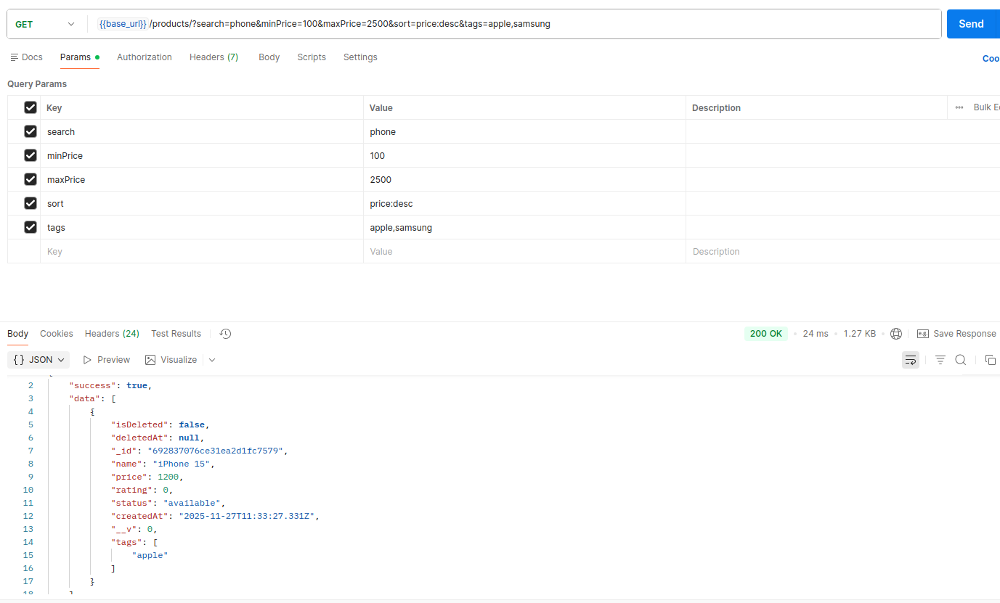

## OVERVIEW
this document explains how the product query engine works.

what is product query engine?
a system that takes URL query parameters
-> converts them into MongoDB queries
-> return filtered, searched, sorted, paginated products

## QUERY : GET http://localhost:3000/apiproducts?search=iphone&minPrice=500&maxPrice=1500&tags=apple&sort=price:desc&page=1&limit=2&includeDeleted=false

what does this query do?
-> It supports regex-based search, price range filtering, tag matching, sorting, pagination, and soft-delete visibility.
-> All query parts are combined into one optimized database query to return exactly the products the user want

## Search engine(Regex-based search)
?search=iphone:-

it is a regex filter which means
-> matches partial words
-> case-insensitive
-> finds phone, PHONE, Smartphone

## Price filtering
minPrice=500&maxPrice=1500:- 

->The engine converts it into:
    price ≥ 100
    price ≤ 500
-> budget filtering

## tag filtering
tags=apple:-

-> engine converts string to array
-> and applies find products that include any of these tags

## sorting engine
sort=price:desc:-

-> engine converts:
    price:desc - {price: -1}
    price:asc - {price: 1}
-> supported on price,rating

## pagination
page=2&limit=10:-

-> engine calculates, skip=10 and take the next 10
-> so you load page 1 -> 1-10
               page 2 -> 11-20
               page 3 -> 21-30
-> avoids sending 10000 products at once

## soft deleting
includeDeleted=false:-

-> the engine includes product with isDeleted=true and deletedAt timestamp
->else hides deleted products by default
-> keep data safe(never actually removed)

## COMBINED QUERY

-> search + min/max price + tags + sorting + pagination + soft deleted

## POSTMAN SCREENSHOT

-> 