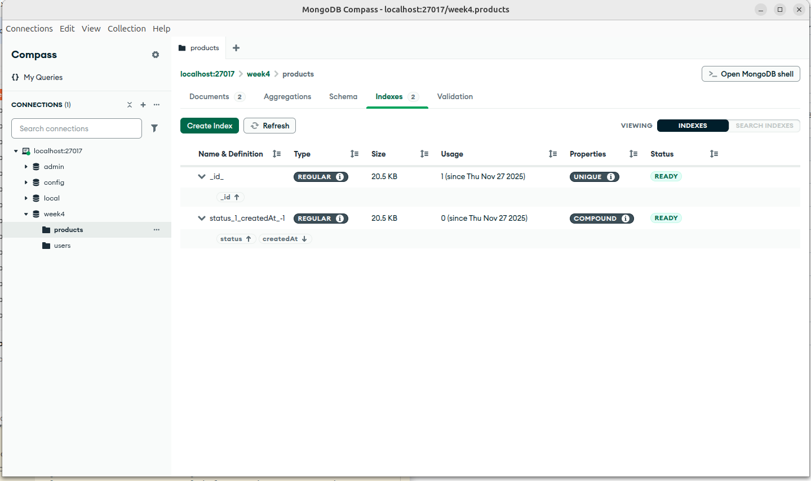
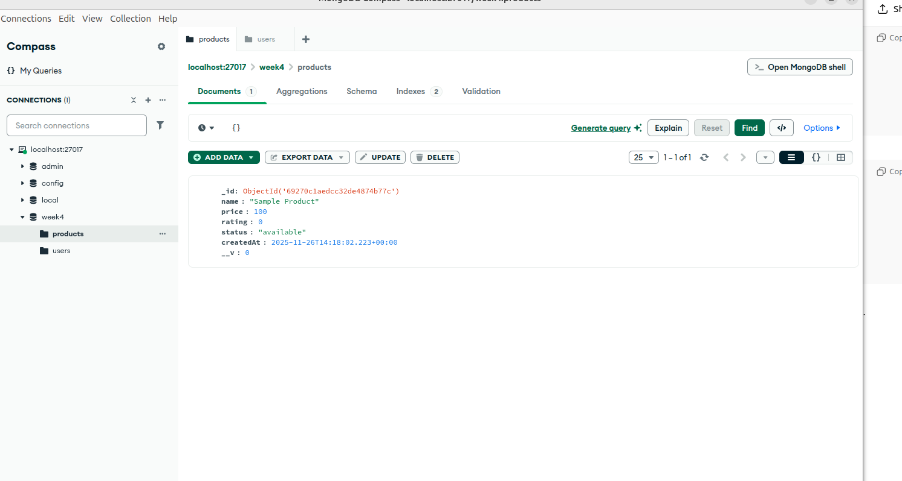
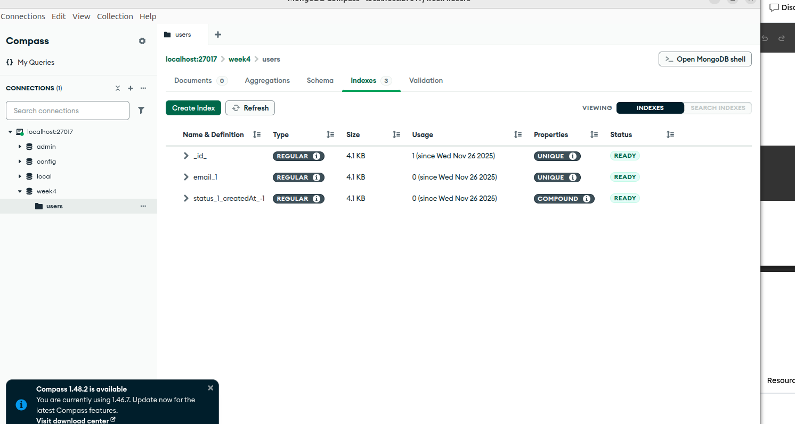
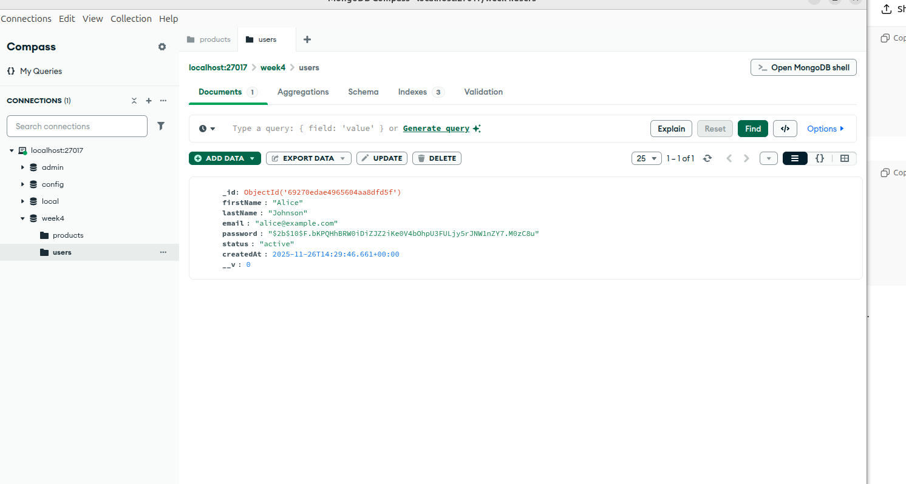
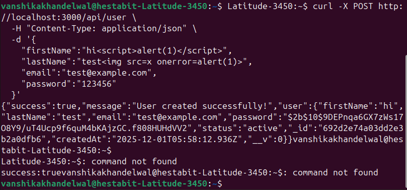
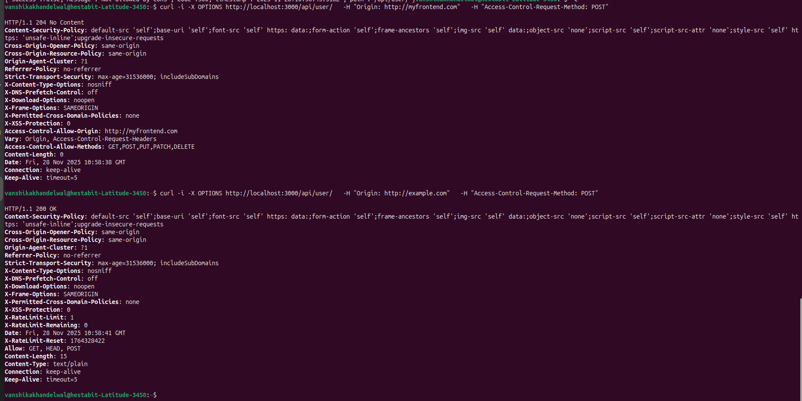
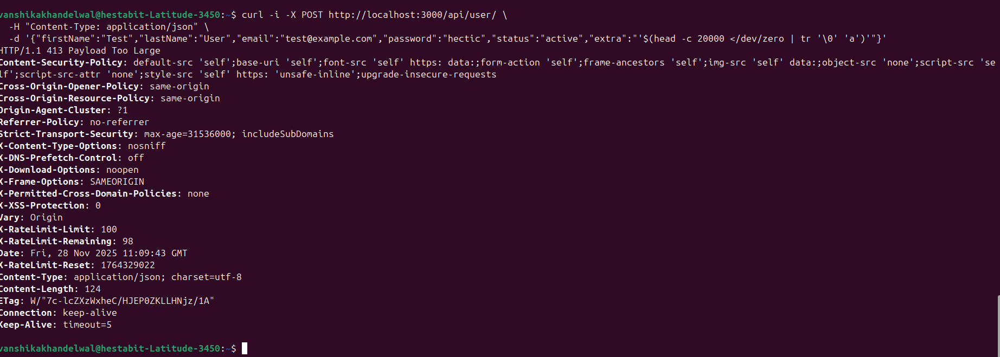

## MONGO INDEXES::

# PRODUCT INDEX:
-> 
-> 

# USER INDEX:
-> 
-> 

## SECURITY::

# XSS (CROSS SITE SCRIPTING):
-> removes the scripting and then adds the user or product
-> 

# NoSQL INJECTION:
->special JSON like $ are removed 
-> 

# CORS:
-> only allowed origin can acces the api
-> 

# HELMET:
-> helmet added
-> 

