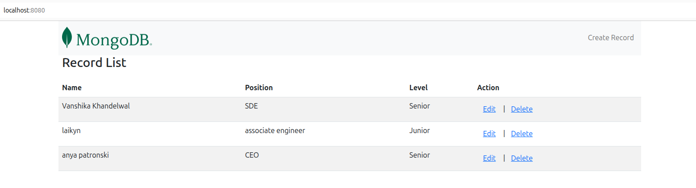

# Production Deployment Guide — MERN App

## APP'S LANDING PAGE
- 

## Overview
This guide explains how to deploy the MERN stack application using Docker for production. It covers the backend, frontend, MongoDB, reverse proxy with Nginx, HTTPS, and CI-style deployment automation.

---

## Architecture
- **Frontend:** React app served via Nginx.
- **Backend:** Node.js/Express API.
- **Database:** MongoDB.
- **Reverse Proxy:** Nginx handles routing and HTTPS.
- **Docker Volumes:** Persist MongoDB data.
- **Docker Networks:** Isolate and connect services.
- **Health Checks:** Ensure containers are running.
- **Logging:** Ensures no over logging

---

## Key Components

### Backend
- Containerized Node.js app.
- Connects to MongoDB using `ATLAS_URI`.
- Health checks monitor if the backend is running.
- Restart policy ensures high availability.

### Frontend
- React app built in Docker.
- Served by Nginx on port 80 inside the container.
- Exposed on host port 8080.
- Health checks monitor availability.

### MongoDB
- Containerized database.
- Uses a Docker volume for persistence.
- Secured with username/password from `.env`.

### Reverse Proxy & HTTPS
- **reverse-proxy:** Nginx automatically routes requests to frontend/backend.
- **nginx-letsencrypt:** Generates SSL certificates using Let's Encrypt.
- All traffic served securely via HTTPS.

---

## Docker Compose Production Setup
- Defined in `docker-compose.prod.yml`.
- Profiles allow running different setups (dev vs prod) without changing app code.
- Uses `.env` file for environment variables.
- Example:
  - `dev` profile → local development.
  - `prod` profile → production deployment.

---

## CI-Style Deployment
- `deploy.sh` automates production deployment.
- Steps it handles:
  1. Builds Docker images for frontend and backend.
  2. Starts containers for MongoDB, backend, frontend, and reverse proxy.
  3. Applies environment variables from `.env`.
  4. Ensures all services are up and running.
- Running `./deploy.sh` simulates a **CI pipeline**: build → deploy → run.

---

## How to Access
- **Frontend:** `http://localhost:8080` 
- **Backend:** `http://localhost:5000`  
- MongoDB is internal to Docker network; backend connects using `mongo:27017`.

---

## Notes
- Always stop old containers before redeploying to avoid port conflicts.
- Health checks restart failing containers automatically.
