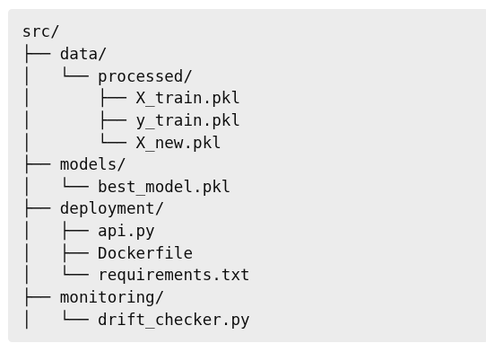

# Deployment Notes

## What this project does
- This project deploys a trained machine learning model as an API
- The API can be used to send data and get predictions
- FastAPI is used to build the API

## Project Structure

- 

## API working
- The API has a `POST /predict` endpoint
- User sends input features in JSON format
- The API checks if the input is valid
- The model makes a prediction and sends it back

## Model usage
- A trained model is loaded from the `models` folder
- The same model used during training is used for prediction

## Input validation
- The API checks the number(27) and type of input features
- If the input is wrong, the API returns an error
- This prevents bad or incomplete data from breaking the model

## Prediction logging
- Every prediction is saved in `prediction_logs.csv`
- Logs include time, request ID, input, and output
- This helps track what the model predicted and when

## Data drift checking
- A drift checker script is added
- It compares training data with new incoming data
- If data changes too much, drift is detected
- This shows when the model may need retraining

## Docker support
- The API is packed inside a Docker container
- Docker ensures the app runs the same everywhere
- Dependencies are installed using `requirements.txt`

## Files created
- `deployment/api.py` – API code
- `Dockerfile` – Docker setup
- `monitoring/drift_checker.py` – drift detection
- `logs/prediction_logs.csv` – prediction history
- `DEPLOYMENT-NOTES.md` – deployment explanation
