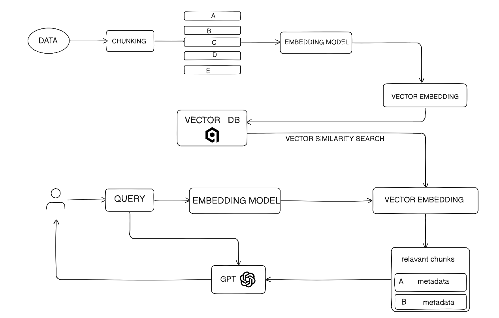

# RETRIEVEAL-AUGMENTED GENERATION ARCHITECTURE

This project implements a **local Retrieval Augmented Generation (RAG) system**.
Instead of letting an LLM answer from memory alone, the system first **retrieves
relevant information from local documents** and then uses that information to
generate a response.

In simple terms:
**Search first → Answer second**

---

## How the System Works

1. User asks a question  
2. The system searches the document database  
3. Relevant text chunks are found  
4. These chunks are given to the LLM as context  
5. The LLM generates a grounded answer  

---

## Main Components

### 1. Ingestion Pipeline
- Loads documents (PDF)
- Splits text into small chunks (500–800 tokens)
- Adds metadata like source file and page number

Purpose:  
Prepare raw documents so they can be searched efficiently.

---

### 2. Embedding Pipeline
- Reads saved chunks
- Converts each chunk into a numerical vector (embedding)
- Stores embeddings in **Qdrant**

Purpose:  
Enable semantic (meaning-based) search instead of keyword search.

---

### 3. Retriever
- Takes a user query
- Finds the most relevant chunks from Qdrant
- Returns top matching chunks

Purpose:  
Fetch only the information needed to answer the question.

---

### 4. Generator (LLM)
- Receives user query + retrieved context
- Generates the final answer using an LLM

Purpose:  
Produce accurate answers based on document content.

---

## Why Chunking & Embeddings Matter

- Large documents cannot be given directly to an LLM
- Chunking breaks documents into manageable pieces
- Embeddings allow similarity search based on meaning
- This improves accuracy and reduces hallucination

---

## Vector Database

- Database: **Qdrant**
- Stores embeddings
- Uses similarity search to find nearest matches
- Fast and scalable for local RAG systems

---

## Summary

This RAG system:
- Works fully with local documents
- Uses embeddings for semantic search
- Prevents hallucinations by grounding answers in data
- Separates ingestion, retrieval, and generation clearly

This makes the system **modular, reliable, and production-ready**.

---

-> 
