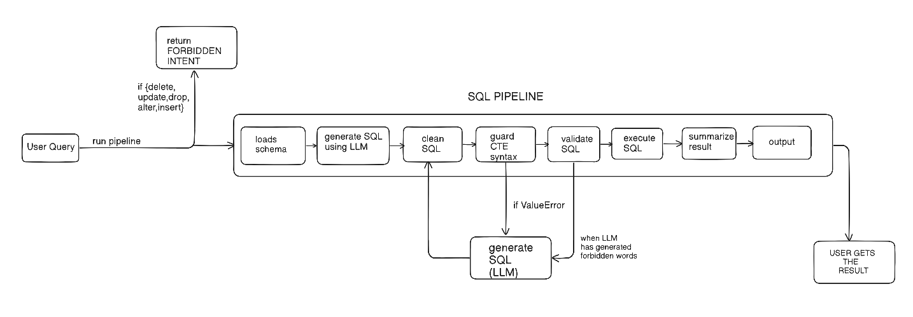

# SQL-QA-DOC.md


## 1. Database Creation (create_db.py)
- Uses `sqlite3` to create `sales.db`
- Drops old tables
- Creates tables:
  - artists(artist_id, name, genre)
  - albums(album_id, artist_id, album_name, release_year)
  - countries(country_id, country_name)
  - sales(sale_id, artist_id, amount, year, country_id)
  - streams(stream_id, artist_id, stream_count, year)
- Inserts random data using random
- Records = rows (50+ rows total)

---

## 2. Schema Loader (schema_loader.py)

### load_schema(db_path)
1. Connect to database
2. Fetch table names from `sqlite_master`
3. For each table:
   - Run `PRAGMA table_info(table_name)`
   - Extract column name and type
4. Build plain-text schema
5. Return schema string

Used to prevent LLM hallucination.

---

## 3. SQL Generator (sql_generator.py)
- Input: User question + schema
- Output: SQL query (SQLite syntax)
- Generated by LLM

---

## 4. SQL Cleaning
### clean_sql(sql)
- Removes ```sql fences
- Trims whitespace
- Ensures executable SQL

---

## 5. User Intent Guard (BEFORE LLM)
- Checks question for:
  - delete, update, insert, drop, alter
- If found:
  - Return: `FORBIDDEN_INTENT: Only READ-ONLY queries are allowed`
  - LLM is NOT called

---

## 6. SQL Validation (AFTER LLM)
### validate_sql(sql)
- Blocks forbidden keywords in generated SQL
- Allows only `SELECT` or `WITH`
- Prevents unsafe execution

---

## 7. CTE Guard
### guard_cte_syntax(sql)
- If `AS (` exists → query must start with `WITH`
- Prevents invalid CTE SQL

---

## 8. LLM SQL Repair Loop
Triggered only for syntax/CTE errors:
1. Catch validation error
2. Send SQL + error to LLM
3. LLM rewrites SQL
4. Re-validate
5. Execute if valid

---

## 9. SQL Execution
### execute_sql(db_path, sql)
- Executes SQL
- Fetches:
  - rows via `fetchall()`
  - columns via `cursor.description`
- Returns `(columns, rows)`

---

## 10. Result Formatting
### summarize_result(columns, rows)
- Converts SQL output to readable text
- If empty → `No data found`

---

## 11. Full Pipeline Flow
1. User enters question
2. User intent checked (read-only)
3. Schema loaded
4. LLM generates SQL
5. SQL cleaned
6. SQL validated + CTE checked
7. SQL executed
8. Results summarized
9. Final answer returned

-> 