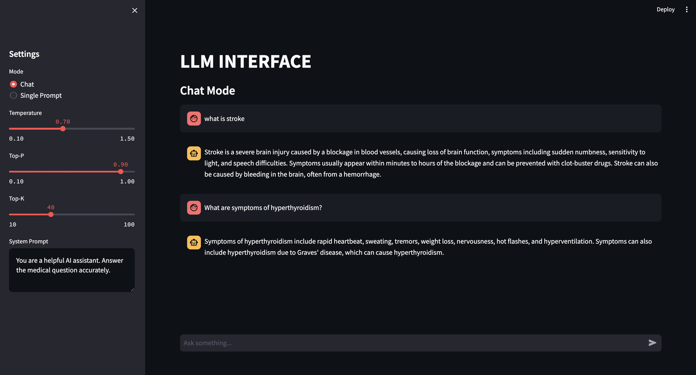

**START THE PROJECT**

- To run the server locally run:-
 uvicorn deploy.app:app --reload -> http://127.0.0.1:8000

- To run the streamlit UI streamlit run:-
 streamlit run UI.py

**UI Interface**

- 

**FEATURES**

- Adjustable **Temperature**: Controls creativity of the model. Low values make responses safe and predictable, high values make them more diverse and creative(Best: 0.7).
- Adjustable **Top-K**: Limits word choices to the top K most likely next words, controlling variety(Best: 40).
- Adjustable **Top-P (nucleus sampling)**: Chooses from words that make up a cumulative probability of p, balancing safety and randomness(Best: 0.9).
- Chat and Single Prompt modes for flexible interaction.
